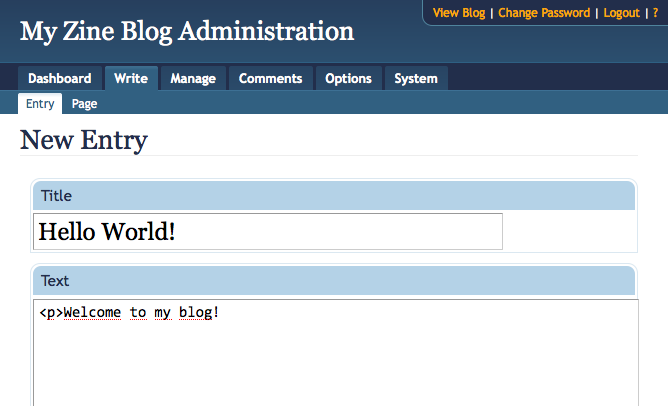
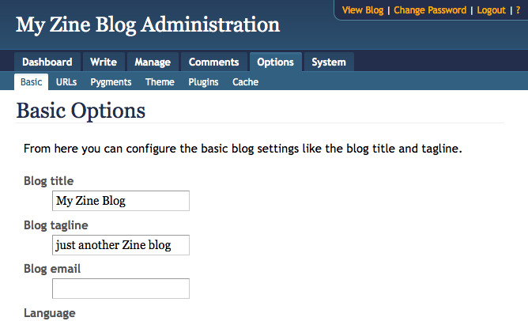
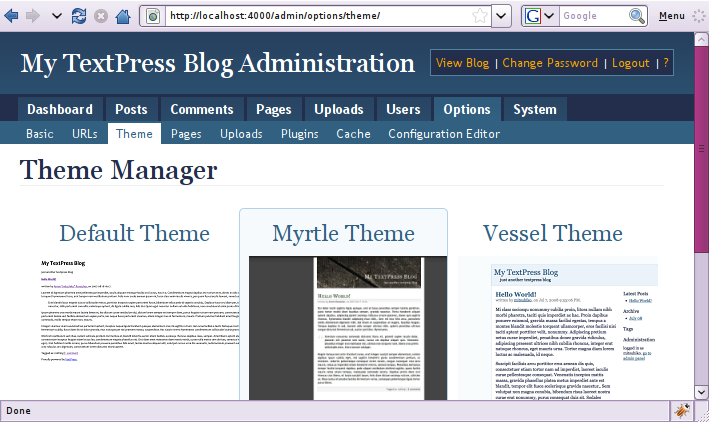

Introduction to Zine
====================

Zine is a content publishing platform with the focus on extensibility
and a user friendly interface.  This chapter of the help gives you a basic
introduction to Zine.

Creating your First Post
------------------------

You can write new blog entries (called posts) by going to the "New Entry"
page.  Either go to "Write -> Entry" or click on the "New Entry" link
on the Dashboard.

After doing that you should see a new page where you can fill out the
boxes provided:

Depending on the active parser you can insert different markup in the
text box, but in the default configuration just throw random HTML into
the text box.

If you click on "Save" the post is saved and you are redirected back to
the page where you came from.  A click on "Save and continue editing"
just saves the changes and you can continue editing.  It's recommended
to click that button every few minutes to make sure the changes are not
lost if the browser or computer crashes.

As long as the post status is not set to published nobody except you
or other authors can see the post.

Select "published" as post status and save to share the post with your
readers.

Configuration
-------------

In order to customize your blog you have to configure it.  This however
is simple and won't take long.  Go to "Options -> Basic" and fill out the
options with useful values.

Design
------

To select a more suitable design go to "Options -> Theme" and click on one
of the themes.  Per default two themes are available (Default and Vessel).
More themes can be added by loading `Plugins <plugins/>`_.

